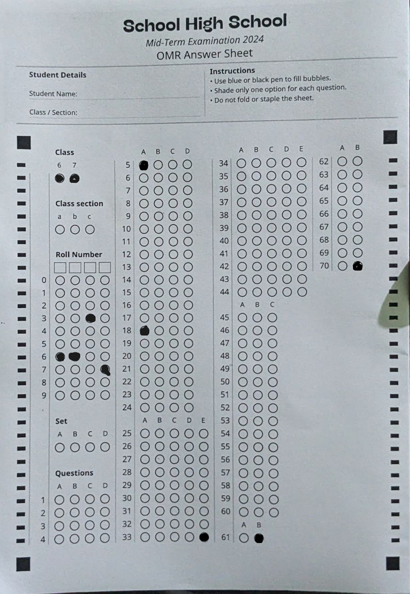
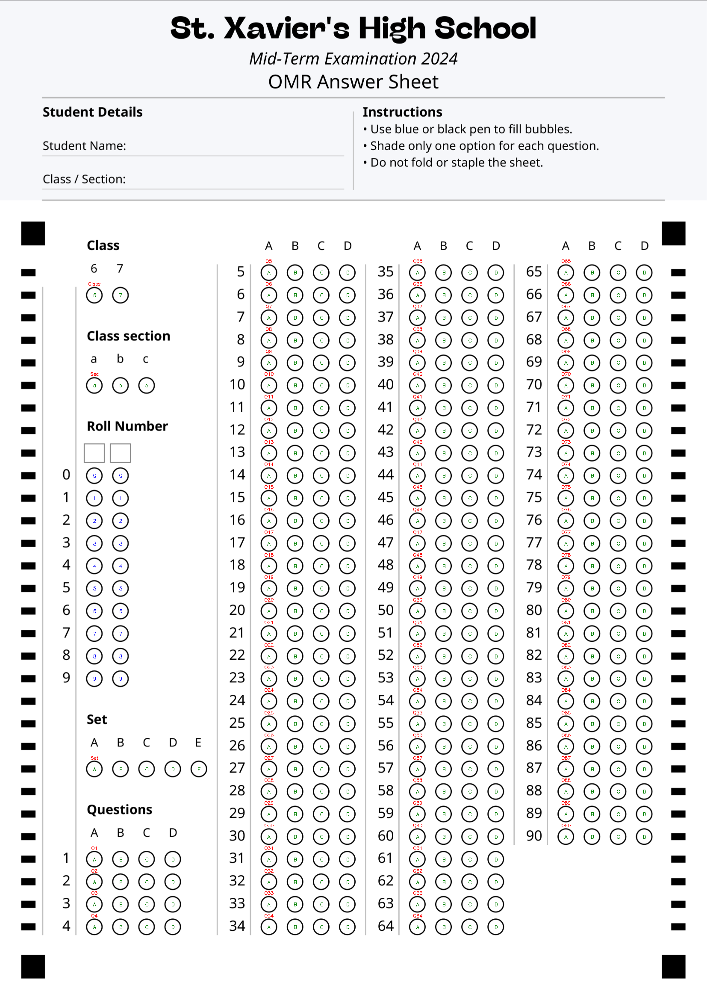

# OMR Sheet Processor

A robust Optical Mark Recognition (OMR) system for processing multiple-choice exam answer sheets. Generates customizable OMR sheets and accurately detects filled bubbles even under challenging real-world conditions like poor lighting, perspective distortion, and varying scan quality.

<table align="center">
  <tr>
    <td></td>
    <td></td>
  </tr>
  <tr>
    <td align="center"><b>Blank OMR Sheet</b></td>
    <td align="center"><b>Processed Result</b></td>
  </tr>
</table>

## Features

### 🎯 Accurate Bubble Detection
- **Adaptive fill threshold** - Automatically adjusts to lighting conditions (overexposed, underexposed, low contrast)
- **Inner region analysis** - Excludes anchor markers and margins to prevent threshold skewing
- **Relative darkness detection** - Compares bubble interior to surrounding background for robust detection

### 📐 Robust Perspective Correction
- **Anchor-based alignment** - Four corner markers for precise skew correction
- **Adaptive resolution** - Preserves original scan quality instead of forcing fixed dimensions
- **Geometric validation** - Tolerates realistic camera angles (up to 7° rotation, 15% alignment variance)

### 🖼️ Real-World Capture Support
- Handles mobile phone camera captures
- Compensates for perspective distortion and rotation
- Works with varied lighting (dark, bright, compressed contrast)
- Maintains accuracy across different scan resolutions (800px - 4000px+)

### 🧪 Comprehensive Testing
- 19 distortion test scenarios
- Visual HTML reports with anchor detection overlays
- 73.7% pass rate on challenging edge cases
- Corner zone visualization for debugging

## Quick Start

### Installation

```bash
# Clone the repository
git clone https://github.com/yourusername/omr-codex.git
cd omr-codex

# Create virtual environment
python -m venv venv
source venv/bin/activate  # On Windows: venv\Scriptsctivate

# Install dependencies
pip install -r requirements.txt
```

### Generate OMR Sheet

```bash
# Generate blank OMR sheet PDF
python omr_sheet_generator_new.py

# Convert to image for testing
python pdf_to_image.py
```

Output: `sheets/omr_sheet_fpdf.pdf` and corresponding PNG image

### Process Scanned Sheets

```bash
# Place scanned images in sheets/ directory
# Process all images
python omr_processor.py
```

Output: `processed/processed_<filename>.png` with labeled bubbles and filled bubble highlights

## Configuration

Edit `omr_config.py` to customize:

```python
@dataclass(frozen=True)
class PageGeometry:
    width: float = 595.276  # A4 width in points
    height: float = 841.89  # A4 height in points
    margin: float = 36

@dataclass(frozen=True)
class BubbleLayout:
    radius: float = 6.5
    vertical_gap: float = 19
    option_gap: float = 9
    fill_threshold: float = 0.4  # Base threshold (0.0-1.0)

@dataclass(frozen=True)
class MarkerConfig:
    anchor_size: float = 20  # Larger = better detection under distortion

@dataclass(frozen=True)
class SheetLayout:
    roll_columns: int = 3
    roll_rows: int = 10
    question_options: int = 4
```

## Testing

Run distortion tests:

```bash
python tools/test_distortions.py
```

Generates HTML report at `distortion_tests/report.html` with:
- 19 test variations (perspective, contrast, aspect, combined)
- Visual comparison (input, anchor detection, processed output)
- Orange corner zones showing expected anchor positions
- Pass/fail status with error details

**Test scenarios:**
- ✅ Perspective distortion (2.5° tilts, 3-6° rotation)
- ✅ Contrast variations (underexposed, overexposed, low range)
- ✅ Aspect distortions (squash, stretch)
- ✅ Combined realistic scenarios
- ❌ Extreme cases (5° tilts, 10° rotation) - edge cases

## Recent Improvements

### v1.3 - Anchor Detection Robustness (2025-01-15)
- 🔧 Increased anchor size: 18pt → 20pt (better separation from 13pt bubbles)
- 🔧 Relaxed geometric validation: 12% → 15% alignment tolerance
- 🎨 Added corner zone visualization to test reports
- 📈 Test pass rate: 68.4% → 73.7%

### v1.2 - Fill Detection Enhancement (2025-01-15)
- 🔧 Calculate threshold from inner region only (exclude anchors/margins)
- 🔧 More aggressive threshold reduction for low contrast (0.5x → 0.3x)
- ✅ Fixed overexposed image bubble detection

### v1.1 - Adaptive Resolution (2025-01-15)
- 🔧 Replace fixed 1400px height with scale-based dimensions
- 🔧 Preserve aspect ratio in minimum bounds
- 🎯 Maintains crisp bubble edges across varying scan qualities

## Known Limitations

- Extreme distortions (>5° tilt, >7° rotation) may fail anchor detection
- Requires all 4 corner anchors visible in frame
- Sheet must be roughly centered with ~25% margin
- Minimum resolution: 800×1000 pixels

## License

MIT License - see LICENSE file for details

## Acknowledgments

Built with:
- OpenCV for image processing
- ReportLab for PDF generation
- NumPy for numerical operations
- pdf2image for PDF conversion
